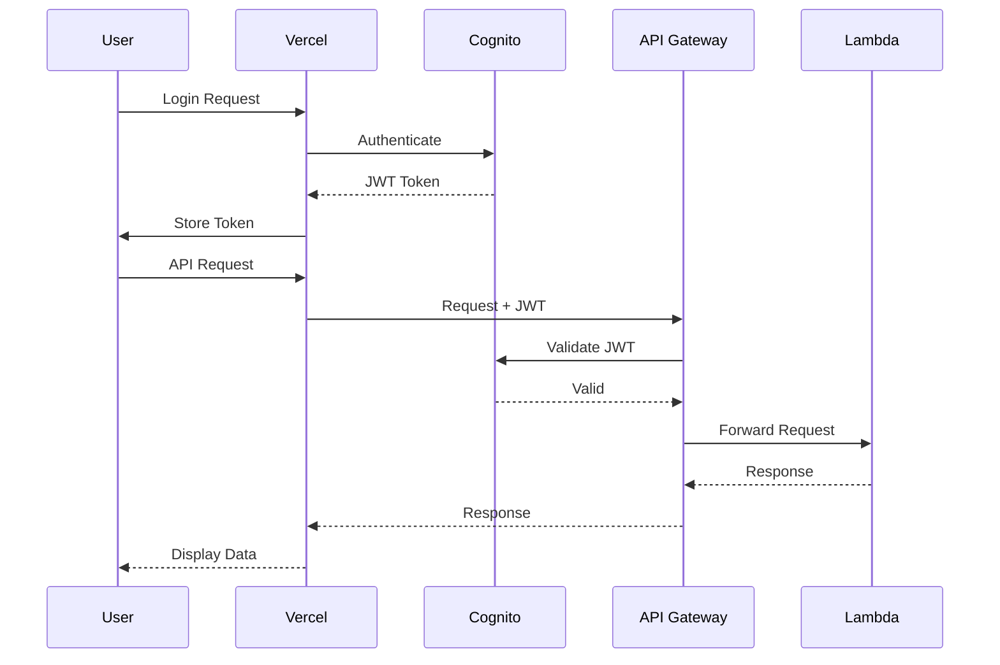

# Technical Specifications: Hybrid Architecture

## Architecture Overview

This document provides detailed technical specifications for the hybrid architecture implementation, where Next.js frontend is hosted on Vercel while backend services remain on AWS infrastructure.

## System Architecture

### Frontend Architecture (Vercel)

```
┌─────────────────────────────────────────────────────────────┐
│                      Vercel Platform                        │
├─────────────────────────────────────────────────────────────┤
│                    Next.js Application                      │
│  ┌─────────────┬──────────────┬───────────────────────┐    │
│  │  App Router │ Server Comps │ Client Components     │    │
│  ├─────────────┼──────────────┼───────────────────────┤    │
│  │  API Client │ Auth Context │ WebSocket Client      │    │
│  ├─────────────┼──────────────┼───────────────────────┤    │
│  │  D3.js      │ Tailwind CSS │ State Management      │    │
│  └─────────────┴──────────────┴───────────────────────┘    │
│                           │                                 │
│                     Edge Network                            │
└───────────────────────────┼─────────────────────────────────┘
                            │
                            ↓ HTTPS/WSS
```

### Backend Architecture (AWS)

```
┌─────────────────────────────────────────────────────────────┐
│                    AWS Infrastructure                       │
├─────────────────────────────────────────────────────────────┤
│  ┌─────────────┬──────────────┬───────────────────────┐    │
│  │ API Gateway │  WebSocket   │    S3 Buckets         │    │
│  ├─────────────┼──────────────┼───────────────────────┤    │
│  │   Lambda    │   Lambda     │  (Data Storage)       │    │
│  │  Functions  │   Handlers   │  (User uploads)       │    │
│  ├─────────────┼──────────────┼───────────────────────┤    │
│  │  DynamoDB   │  DynamoDB    │    Cognito            │    │
│  │   Tables    │   Streams    │  User Pools           │    │
│  └─────────────┴──────────────┴───────────────────────┘    │
│                                                             │
└─────────────────────────────────────────────────────────────┘
```

## Frontend Specifications

### Technology Stack

- **Framework**: Next.js 14.0+ with App Router
- **Language**: TypeScript 5.0+
- **UI Library**: React 18.0+ with Server Components
- **Styling**: Tailwind CSS v4
- **State Management**: Context API / Zustand
- **Data Visualization**: D3.js 7.0+
- **HTTP Client**: Axios / Fetch API
- **WebSocket**: Native WebSocket API
- **Build Tool**: Webpack (via Next.js)
- **Package Manager**: npm / yarn

### Project Structure

```
src/frontend/nextjs-app/
├── app/
│   ├── (auth)/
│   │   ├── login/
│   │   ├── signup/
│   │   └── reset-password/
│   ├── (dashboard)/
│   │   ├── visualizations/
│   │   └── settings/
│   ├── api/
│   │   └── [...proxy]/
│   ├── layout.tsx
│   └── page.tsx
├── components/
│   ├── ui/
│   ├── visualizations/
│   ├── forms/
│   └── layouts/
├── services/
│   ├── api/
│   ├── websocket/
│   └── auth/
├── hooks/
├── utils/
├── types/
└── config/
```

### Environment Configuration

```typescript
// config/environment.ts
export const config = {
  api: {
    baseUrl: process.env.NEXT_PUBLIC_AWS_API_ENDPOINT!,
    websocketUrl: process.env.NEXT_PUBLIC_AWS_WEBSOCKET_ENDPOINT!,
    timeout: 30000,
  },
  auth: {
    region: process.env.NEXT_PUBLIC_AWS_REGION!,
    userPoolId: process.env.NEXT_PUBLIC_USER_POOL_ID!,
    clientId: process.env.NEXT_PUBLIC_USER_POOL_CLIENT_ID!,
  },
  features: {
    enableWebsocket: process.env.NEXT_PUBLIC_ENABLE_WEBSOCKET === 'true',
    enableAnalytics: process.env.NEXT_PUBLIC_ENABLE_ANALYTICS === 'true',
  },
};
```

### API Client Implementation

```typescript
// services/api/client.ts
import axios, { AxiosInstance } from 'axios';
import { getAuthToken, refreshToken } from '../auth';

class ApiClient {
  private client: AxiosInstance;

  constructor() {
    this.client = axios.create({
      baseURL: config.api.baseUrl,
      timeout: config.api.timeout,
    });

    this.setupInterceptors();
  }

  private setupInterceptors() {
    // Request interceptor
    this.client.interceptors.request.use(
      async (config) => {
        const token = await getAuthToken();
        if (token) {
          config.headers.Authorization = `Bearer ${token}`;
        }
        return config;
      },
      (error) => Promise.reject(error)
    );

    // Response interceptor
    this.client.interceptors.response.use(
      (response) => response,
      async (error) => {
        if (error.response?.status === 401) {
          const newToken = await refreshToken();
          if (newToken) {
            error.config.headers.Authorization = `Bearer ${newToken}`;
            return this.client(error.config);
          }
        }
        return Promise.reject(error);
      }
    );
  }

  // API methods
  async getVisualizations() {
    return this.client.get('/visualizations');
  }

  async updateParameters(visualizationId: string, params: any) {
    return this.client.post(`/visualizations/${visualizationId}/parameters`, params);
  }
}

export default new ApiClient();
```

### WebSocket Implementation

```typescript
// services/websocket/manager.ts
class WebSocketManager {
  private ws: WebSocket | null = null;
  private reconnectAttempts = 0;
  private maxReconnectAttempts = 5;
  private reconnectInterval = 1000;
  private messageHandlers: Map<string, Function> = new Map();

  connect(token: string) {
    const wsUrl = `${config.api.websocketUrl}?token=${token}`;

    this.ws = new WebSocket(wsUrl);

    this.ws.onopen = this.handleOpen.bind(this);
    this.ws.onmessage = this.handleMessage.bind(this);
    this.ws.onclose = this.handleClose.bind(this);
    this.ws.onerror = this.handleError.bind(this);
  }

  private handleOpen() {
    console.log('WebSocket connected');
    this.reconnectAttempts = 0;
  }

  private handleMessage(event: MessageEvent) {
    const data = JSON.parse(event.data);
    const handler = this.messageHandlers.get(data.type);
    if (handler) {
      handler(data.payload);
    }
  }

  private handleClose() {
    this.attemptReconnect();
  }

  private attemptReconnect() {
    if (this.reconnectAttempts < this.maxReconnectAttempts) {
      setTimeout(() => {
        this.reconnectAttempts++;
        const token = getAuthToken();
        if (token) {
          this.connect(token);
        }
      }, this.reconnectInterval * Math.pow(2, this.reconnectAttempts));
    }
  }

  on(messageType: string, handler: Function) {
    this.messageHandlers.set(messageType, handler);
  }

  send(type: string, payload: any) {
    if (this.ws?.readyState === WebSocket.OPEN) {
      this.ws.send(JSON.stringify({ type, payload }));
    }
  }
}

export default new WebSocketManager();
```

## Backend Specifications

### AWS Services Configuration

#### API Gateway

```yaml
Type: AWS::ApiGatewayV2::Api
Properties:
  Name: HybridArchAPI
  ProtocolType: HTTP
  CorsConfiguration:
    AllowOrigins:
      - https://your-app.vercel.app
      - https://preview-*.vercel.app
      - http://localhost:3000
    AllowMethods:
      - GET
      - POST
      - PUT
      - DELETE
      - OPTIONS
    AllowHeaders:
      - Content-Type
      - Authorization
      - X-Amz-Date
      - X-Api-Key
      - X-Amz-Security-Token
    ExposeHeaders:
      - x-amzn-RequestId
      - x-amz-apigw-id
    MaxAge: 86400
```

#### Lambda Function Example

```python
# lambda/visualizations/get_visualization.py
import json
import boto3
from typing import Dict, Any
from aws_lambda_powertools import Logger, Tracer, Metrics
from aws_lambda_powertools.logging import correlation_paths
from aws_lambda_powertools.metrics import MetricUnit

logger = Logger()
tracer = Tracer()
metrics = Metrics()

dynamodb = boto3.resource('dynamodb')
table = dynamodb.Table('Visualizations')

def build_cors_response(status_code: int, body: Any, origin: str) -> Dict:
    """Build response with CORS headers"""
    allowed_origins = [
        'https://your-app.vercel.app',
        'https://preview-*.vercel.app',
        'http://localhost:3000'
    ]

    response_origin = origin if origin in allowed_origins else allowed_origins[0]

    return {
        'statusCode': status_code,
        'headers': {
            'Content-Type': 'application/json',
            'Access-Control-Allow-Origin': response_origin,
            'Access-Control-Allow-Credentials': 'true',
        },
        'body': json.dumps(body)
    }

@logger.inject_lambda_context(correlation_id_path=correlation_paths.API_GATEWAY_REST)
@tracer.capture_lambda_handler
@metrics.log_metrics(capture_cold_start_metric=True)
def handler(event: Dict, context: Any) -> Dict:
    """Get visualization by ID"""
    try:
        # Extract parameters
        visualization_id = event['pathParameters']['id']
        user_id = event['requestContext']['authorizer']['claims']['sub']
        origin = event['headers'].get('origin', '')

        # Get visualization from DynamoDB
        response = table.get_item(
            Key={
                'id': visualization_id,
                'userId': user_id
            }
        )

        if 'Item' not in response:
            return build_cors_response(404, {'error': 'Visualization not found'}, origin)

        # Log metric
        metrics.add_metric(name="GetVisualization", unit=MetricUnit.Count, value=1)

        return build_cors_response(200, response['Item'], origin)

    except Exception as e:
        logger.error(f"Error getting visualization: {str(e)}")
        return build_cors_response(500, {'error': 'Internal server error'}, origin)
```

### DynamoDB Tables

#### Visualizations Table

```typescript
interface VisualizationTable {
  id: string;              // Partition key
  userId: string;          // Sort key
  name: string;
  type: 'normal' | 'scatter' | 'histogram';
  parameters: {
    mean: number;
    stdDev: number;
    color: string;
  };
  createdAt: string;
  updatedAt: string;
  version: number;
}
```

#### Parameters History Table

```typescript
interface ParameterHistoryTable {
  visualizationId: string;  // Partition key
  timestamp: string;        // Sort key
  userId: string;
  parameters: {
    mean: number;
    stdDev: number;
  };
  action: 'create' | 'update' | 'delete';
}
```

#### WebSocket Connections Table

```typescript
interface ConnectionTable {
  connectionId: string;     // Partition key
  userId: string;
  visualizationId: string;
  connectedAt: string;
  ttl: number;             // For automatic cleanup
}
```

### Terraform Configuration

```hcl
# main/cors.tf
resource "aws_apigatewayv2_api" "main" {
  name          = "${var.project_name}-api-${var.environment}"
  protocol_type = "HTTP"

  cors_configuration {
    allow_origins = [
      "https://${var.vercel_app_domain}",
      "https://preview-*.vercel.app",
      "http://localhost:3000"
    ]
    allow_methods = ["GET", "POST", "PUT", "DELETE", "OPTIONS"]
    allow_headers = ["content-type", "authorization"]
    max_age       = 86400
  }
}

# main/lambda.tf
module "visualization_lambda" {
  source = "./modules/lambda_function"

  function_name = "${var.project_name}-get-visualization-${var.environment}"
  runtime       = "python3.9"
  handler       = "get_visualization.handler"

  environment_variables = {
    ALLOWED_ORIGINS = jsonencode([
      "https://${var.vercel_app_domain}",
      "https://preview-*.vercel.app",
      "http://localhost:3000"
    ])
    TABLE_NAME = aws_dynamodb_table.visualizations.name
  }
}
```

## Security Specifications

### Authentication Flow



### CORS Configuration

```javascript
// Lambda CORS middleware
const corsMiddleware = (handler) => async (event, context) => {
  const origin = event.headers.origin || event.headers.Origin;
  const allowedOrigins = process.env.ALLOWED_ORIGINS.split(',');

  const corsHeaders = {
    'Access-Control-Allow-Origin': allowedOrigins.includes(origin) ? origin : allowedOrigins[0],
    'Access-Control-Allow-Methods': 'GET,POST,PUT,DELETE,OPTIONS',
    'Access-Control-Allow-Headers': 'Content-Type,Authorization',
    'Access-Control-Allow-Credentials': 'true',
  };

  // Handle preflight
  if (event.httpMethod === 'OPTIONS') {
    return {
      statusCode: 200,
      headers: corsHeaders,
      body: '',
    };
  }

  // Execute handler
  const response = await handler(event, context);

  // Add CORS headers to response
  return {
    ...response,
    headers: {
      ...response.headers,
      ...corsHeaders,
    },
  };
};
```

### IAM Policies

```json
{
  "Version": "2012-10-17",
  "Statement": [
    {
      "Effect": "Allow",
      "Action": [
        "dynamodb:GetItem",
        "dynamodb:PutItem",
        "dynamodb:UpdateItem",
        "dynamodb:Query"
      ],
      "Resource": [
        "arn:aws:dynamodb:${region}:${account}:table/Visualizations",
        "arn:aws:dynamodb:${region}:${account}:table/ParameterHistory"
      ]
    },
    {
      "Effect": "Allow",
      "Action": [
        "cognito-idp:GetUser",
        "cognito-idp:ListUsers"
      ],
      "Resource": "arn:aws:cognito-idp:${region}:${account}:userpool/${userPoolId}"
    }
  ]
}
```

## Performance Specifications

### Frontend Performance

- **Initial Load Time**: < 3s
- **First Contentful Paint**: < 1.5s
- **Time to Interactive**: < 3.5s
- **Lighthouse Score**: > 85

### Backend Performance

- **API Response Time**: < 300ms (p95)
- **WebSocket Latency**: < 100ms
- **Lambda Cold Start**: < 1s
- **DynamoDB Query Time**: < 50ms

### Caching Strategy

```typescript
// Frontend caching with SWR
import useSWR from 'swr';

const fetcher = (url: string) => apiClient.get(url).then(res => res.data);

export const useVisualization = (id: string) => {
  const { data, error, mutate } = useSWR(
    `/visualizations/${id}`,
    fetcher,
    {
      revalidateOnFocus: false,
      revalidateOnReconnect: false,
      refreshInterval: 30000, // 30 seconds
    }
  );

  return {
    visualization: data,
    isLoading: !error && !data,
    isError: error,
    mutate,
  };
};
```

## Monitoring and Logging

### Frontend Monitoring

```typescript
// Vercel Analytics integration
import { Analytics } from '@vercel/analytics/react';
import { SpeedInsights } from '@vercel/speed-insights/next';

export default function RootLayout({ children }) {
  return (
    <html>
      <body>
        {children}
        <Analytics />
        <SpeedInsights />
      </body>
    </html>
  );
}
```

### Backend Monitoring

```python
# CloudWatch metrics
from aws_lambda_powertools import Metrics
from aws_lambda_powertools.metrics import MetricUnit

metrics = Metrics()

@metrics.log_metrics
def handler(event, context):
    # Add custom metric
    metrics.add_metric(
        name="VisualizationUpdate",
        unit=MetricUnit.Count,
        value=1
    )

    # Add metadata
    metrics.add_metadata(
        key="visualizationType",
        value=event.get("type")
    )
```

## Deployment Specifications

### Vercel Configuration

```json
{
  "framework": "nextjs",
  "buildCommand": "npm run build",
  "devCommand": "npm run dev",
  "installCommand": "npm install",
  "outputDirectory": ".next",
  "regions": ["iad1"],
  "functions": {
    "app/api/proxy/[...path].ts": {
      "maxDuration": 30
    }
  },
  "env": {
    "NEXT_PUBLIC_AWS_API_ENDPOINT": "@aws_api_endpoint",
    "NEXT_PUBLIC_AWS_REGION": "@aws_region",
    "NEXT_PUBLIC_USER_POOL_ID": "@cognito_user_pool_id",
    "NEXT_PUBLIC_USER_POOL_CLIENT_ID": "@cognito_client_id"
  }
}
```

### GitHub Actions Workflow

```yaml
name: Deploy to Vercel

on:
  push:
    branches: [main]
  pull_request:
    branches: [main]

jobs:
  deploy:
    runs-on: ubuntu-latest
    steps:
      - uses: actions/checkout@v3

      - name: Setup Node.js
        uses: actions/setup-node@v3
        with:
          node-version: '18'

      - name: Install dependencies
        run: npm ci

      - name: Run tests
        run: npm test

      - name: Build application
        run: npm run build

      - name: Deploy to Vercel
        uses: vercel/action@v28
        with:
          vercel-token: ${{ secrets.VERCEL_TOKEN }}
          vercel-org-id: ${{ secrets.VERCEL_ORG_ID }}
          vercel-project-id: ${{ secrets.VERCEL_PROJECT_ID }}
          vercel-args: '${{ github.event_name == 'push' && '--prod' || '' }}'
```

## Testing Specifications

### Frontend Testing

```typescript
// __tests__/api/client.test.ts
import { renderHook } from '@testing-library/react';
import { useVisualization } from '@/hooks/useVisualization';
import { mockServer } from '@/test/server';

describe('API Client', () => {
  beforeAll(() => mockServer.listen());
  afterEach(() => mockServer.resetHandlers());
  afterAll(() => mockServer.close());

  test('fetches visualization data', async () => {
    const { result, waitForNextUpdate } = renderHook(() =>
      useVisualization('test-id')
    );

    await waitForNextUpdate();

    expect(result.current.visualization).toBeDefined();
    expect(result.current.isError).toBe(false);
  });
});
```

### Backend Testing

```python
# tests/test_get_visualization.py
import pytest
from moto import mock_dynamodb
import boto3
from lambda_functions.get_visualization import handler

@mock_dynamodb
def test_get_visualization_success():
    # Setup mock DynamoDB
    dynamodb = boto3.resource('dynamodb', region_name='us-east-1')
    table = dynamodb.create_table(
        TableName='Visualizations',
        KeySchema=[
            {'AttributeName': 'id', 'KeyType': 'HASH'},
            {'AttributeName': 'userId', 'KeyType': 'RANGE'}
        ],
        AttributeDefinitions=[
            {'AttributeName': 'id', 'AttributeType': 'S'},
            {'AttributeName': 'userId', 'AttributeType': 'S'}
        ],
        BillingMode='PAY_PER_REQUEST'
    )

    # Add test data
    table.put_item(Item={
        'id': 'test-viz',
        'userId': 'test-user',
        'name': 'Test Visualization'
    })

    # Test handler
    event = {
        'pathParameters': {'id': 'test-viz'},
        'requestContext': {
            'authorizer': {
                'claims': {'sub': 'test-user'}
            }
        },
        'headers': {'origin': 'http://localhost:3000'}
    }

    response = handler(event, {})

    assert response['statusCode'] == 200
    assert 'Test Visualization' in response['body']
```

## Conclusion

This technical specification provides a comprehensive guide for implementing the hybrid architecture, combining Vercel's frontend hosting capabilities with AWS's robust backend infrastructure. The approach ensures optimal performance, security, and developer experience while maintaining flexibility for future enhancements.</content>
