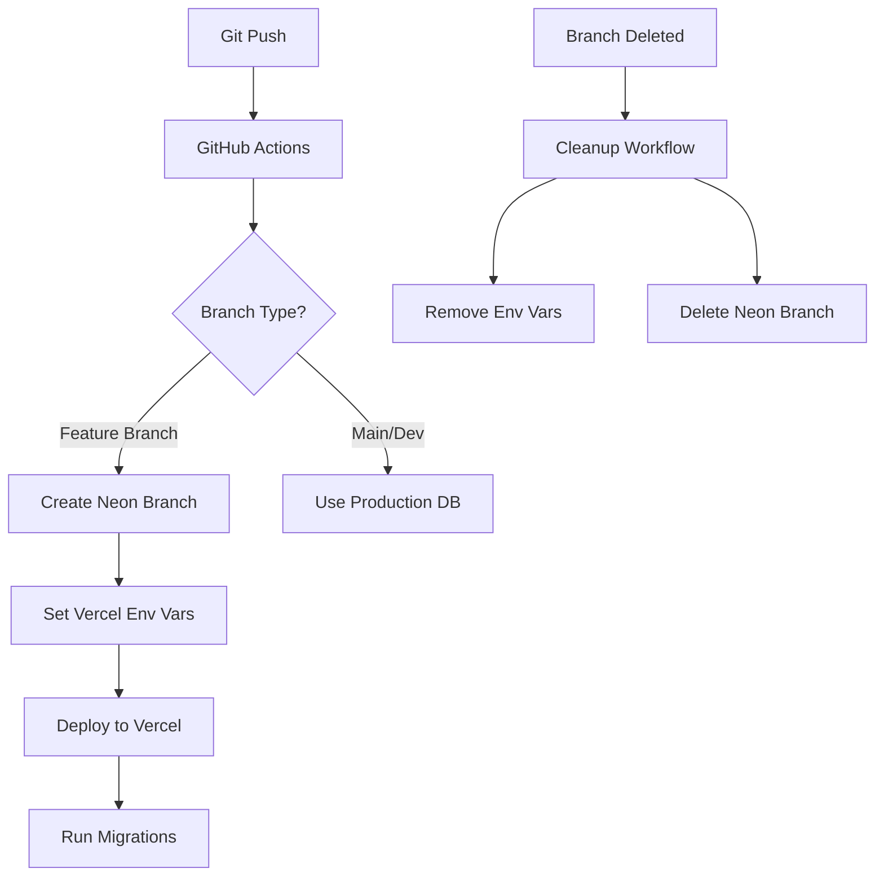

# Vercel + Neon Branch Deployment Guide for Git-Connected Projects (2025 Edition)

## Table of Contents
1. [Overview](#overview)
2. [Architecture](#architecture)
3. [Setup Requirements](#setup-requirements)
4. [How It Works](#how-it-works)
5. [Configuration](#configuration)
6. [Workflows](#workflows)
7. [Custom Environments and Staging](#custom-environments-and-staging)
8. [Troubleshooting](#troubleshooting)
9. [Monitoring](#monitoring)
10. [Security](#security)
11. [Best Practices](#best-practices)

## Overview

This guide covers the setup and management of branch-specific database environments for **Git-connected Vercel projects**. The system automatically provisions isolated database environments for each Git branch, ensuring that preview deployments on Vercel have their own dedicated Neon database branch. This prevents data conflicts between different feature branches and provides a production-like environment for testing.

**Prerequisites**: This guide assumes your Vercel project is connected to a Git repository (GitHub, GitLab, or Bitbucket). For projects deployed via CLI without Git integration, see Vercel's documentation on deployment-time environment variables.

### Key Features
- 🔄 Automatic database branch creation for each Git branch
- 🔐 Branch-specific environment variables in Vercel
- 🚀 Seamless integration with Vercel preview deployments
- 🧹 Automatic cleanup when branches are deleted
- 🔁 Retry logic for handling race conditions
- 📊 Database migration support

## Architecture



### Components

1. **GitHub Actions Workflows**:
   - `nextjs-deploy-with-neon.yml`: Main deployment workflow
   - `cleanup-branch-resources.yml`: Resource cleanup workflow

2. **Vercel Environment Variables**:
   - `DATABASE_URL`: Branch-specific database connection (pooled)
   - `DATABASE_URL_UNPOOLED`: Direct database connection
   - `DEPLOYMENT_BRANCH`: Current branch name

3. **Neon Database Branches**:
   - Named using pattern: `branch/{sanitized-branch-name}`
   - Isolated data environment for each feature branch
   - Automatic creation and deletion

## Setup Requirements

### Prerequisites

1. **Vercel Project**: Must be connected to a Git repository (GitHub, GitLab, or Bitbucket)
   - Verify with: `vercel project ls` (should show Git integration)
   - If not connected, link via Vercel dashboard or `vercel link`

2. **GitHub Secrets**:
   ```
   VERCEL_TOKEN         # Vercel API token
   VERCEL_ORG_ID        # Vercel organization ID
   VERCEL_PROJECT_ID    # Vercel project ID
   NEON_API_KEY         # Neon API key
   NEON_PROJECT_ID      # Neon project ID
   ```

3. **Vercel CLI**: Version 28.9.0 or later (for `--git-branch` support in `vercel pull` and `vercel env pull` commands)

4. **Project Structure**:
   - Next.js application in `src/frontend/nextjs-app/`
   - Drizzle ORM for database management
   - Database migrations in `drizzle/` directory

### Initial Setup

1. **Create Vercel Project**:
   ```bash
   vercel link
   ```

2. **Get Vercel Project Info**:
   ```bash
   vercel project ls
   ```

3. **Create Neon Project**:
   - Go to [Neon Console](https://console.neon.tech/)
   - Create a new project
   - Copy the project ID

4. **Configure GitHub Secrets**:
   - Go to Settings → Secrets → Actions
   - Add all required secrets

## How It Works

### Deployment Flow

1. **Branch Push**: Developer pushes to a feature branch
2. **Workflow Triggers**: GitHub Actions workflow starts
3. **Branch Sanitization**: Branch name is sanitized for database naming
   ```bash
   # Example: feature/user-auth → feature-user-auth
   sed 's/[^a-zA-Z0-9.-]/-/g' | tr '[:upper:]' '[:lower:]' | cut -c1-63
   ```
4. **Neon Branch Creation**: Creates database branch if it doesn't exist
5. **Environment Variables**: Sets branch-specific DATABASE_URL in Vercel
6. **Deployment**: Vercel builds and deploys the application
7. **Migrations**: Database migrations run against the new branch

### Environment Variable Management (2025)

#### Key Features
- **Encryption**: All environment variable values are now encrypted at rest
- **Branch-Specific Overrides**: You don't need to replicate all Preview Environment Variables for each branch – only add values you wish to override
- **No Type Specification**: No need to specify variable type (Plaintext, Secret, System) as all values are encrypted
- **Automatic Sync**: Git-connected projects automatically receive branch-specific variables during deployment

#### CLI Syntax for Branch-Specific Variables

1. **Adding Variables to Specific Branches**:
   ```bash
   # Syntax: vercel env add <name> <environment> <gitbranch>
   vercel env add DATABASE_URL preview feature-auth

   # Using input redirection for value
   vercel env add DATABASE_URL preview feature-auth <<< "$DATABASE_URL"

   # From file content
   vercel env add DATABASE_URL preview feature-auth < db-url.txt
   ```

2. **Pulling Branch-Specific Variables**:
   ```bash
   # Pull preview environment variables for specific branch
   vercel pull --environment=preview --git-branch=feature-auth

   # Pull environment variables only
   vercel env pull --environment=preview --git-branch=feature-auth
   ```

3. **Listing Branch Variables**:
   ```bash
   # List all preview environment variables
   vercel env ls preview

   # List variables for specific environment and branch
   vercel env ls preview feature-auth
   ```

#### Variable Persistence
Variables set with `vercel env add` persist across deployments and are automatically applied when the corresponding Git branch is deployed. Vercel's Git integration ensures the correct branch-specific variables are used for each preview deployment.

## Configuration

### Branch Connection Module

The `branch-connection.ts` module handles database URL resolution:

```typescript
// Determines environment based on Vercel env vars
export function getEnvironment(): 'production' | 'preview' | 'development' {
  if (process.env.NODE_ENV === 'development' && !process.env.VERCEL) {
    return 'development';
  }
  if (process.env.VERCEL_ENV === 'production') {
    return 'production';
  }
  if (process.env.VERCEL_ENV === 'preview') {
    return 'preview';
  }
  // ... additional logic
}
```

### Migration Script

The `migrate-only.ts` script runs migrations in CI/CD:

```typescript
import { migrate } from 'drizzle-orm/postgres-js/migrator';
import { db } from '../app/db/drizzle';

await migrate(db, {
  migrationsFolder: 'drizzle',
});
```

## Workflows

### Deployment Workflow Features

- **Concurrency Control**: Prevents multiple simultaneous deployments per branch
- **Code Quality Checks**: Runs linting and type checking before deployment
- **Build Optimization**: Uses Vercel's prebuilt artifacts
- **Custom Aliases**: Creates branch-specific URLs like `feature-auth-{owner}.vercel.app`

### Cleanup Workflow Features

- **Automatic Triggers**: On branch deletion or PR merge
- **Protected Branches**: Skips cleanup for main and dev branches
- **Error Handling**: Continues cleanup even if some steps fail
- **Comprehensive Logging**: Details what was cleaned up

## Custom Environments and Staging

### Overview
Custom environments in Vercel allow you to create dedicated deployment environments beyond the standard production and preview. This is particularly useful for staging workflows and complex deployment pipelines.

### Setting Up a Staging Environment

1. **Create Custom Environment** (Pro/Enterprise plans):
   ```bash
   # Deploy to custom staging environment
   vercel deploy --target=staging

   # Pull staging environment variables
   vercel pull --environment=staging
   ```

2. **Branch-Based Staging** (All plans):
   For Hobby users or simpler setups, use branch-specific configurations:
   ```bash
   # Create a dedicated staging branch
   git checkout -b staging

   # Add staging-specific environment variables
   vercel env add API_URL preview staging <<< "https://staging.api.example.com"
   vercel env add DB_POOL_SIZE preview staging <<< "10"
   ```

3. **Domain Configuration**:
   ```bash
   # Add staging domain to branch
   vercel domains add staging.example.com --scope=preview --git-branch=staging
   ```

### Environment Variable Inheritance

Environment variables follow an inheritance pattern:
1. **Base Preview Variables**: Applied to all preview deployments
2. **Branch-Specific Overrides**: Override base values for specific branches
3. **Custom Environment Variables**: Complete control for custom environments

Example workflow:
```bash
# Set base preview variable
vercel env add API_TIMEOUT preview <<< "30000"

# Override for staging branch
vercel env add API_TIMEOUT preview staging <<< "60000"

# Override for feature branch
vercel env add API_TIMEOUT preview feature-long-running <<< "120000"
```

### Staged Production Deployments

Create production builds without immediately assigning them to production domains:
```bash
# Create staged production deployment
vercel deploy --prod --skip-domain

# Promote staged deployment after verification
vercel promote [deployment-url] --scope=production
```

## Troubleshooting

### Common Issues

1. **"No database URL found for preview environment"**
   - **Cause**: Environment variable not set or race condition
   - **Fix**: Check Vercel dashboard for branch-specific variables
   - **Prevention**: Retry logic handles most cases automatically

2. **Migration Failures**
   - **Cause**: Database not ready or connection issues
   - **Fix**: Re-run deployment or manually run migrations
   - **Check**: Verify DATABASE_URL is correct in Vercel

3. **Cleanup Failures**
   - **Cause**: Resources already deleted or API issues
   - **Fix**: Check logs, manual cleanup if needed
   - **Monitor**: GitHub Actions tab shows cleanup status

4. **CLI Deployments Not Using Branch Variables**
   - **Cause**: Git metadata missing when deploying via CLI
   - **Fix**: Use `--meta` flag to specify Git information
   - **Example**:
     ```bash
     vercel deploy --meta githubDeployment="1" \
                   --meta githubCommitRef="feature/branch-name"
     ```
   - **Required**: Always include one of:
     - `githubDeployment="1"` for GitHub
     - `gitlabDeployment="1"` for GitLab
     - `bitbucketDeployment="1"` for Bitbucket

### Debug Commands

```bash
# List Vercel environment variables
vercel env ls preview

# Check specific branch variables
vercel env ls preview | grep "branch-name"

# Test database connection
curl https://your-app.vercel.app/api/debug/db-connection

# List Neon branches
curl -H "Authorization: Bearer $NEON_API_KEY" \
  "https://console.neon.tech/api/v2/projects/$PROJECT_ID/branches"
```

### Manual Cleanup

If automatic cleanup fails:

```bash
# Remove Vercel env vars for specific branch
vercel env rm DATABASE_URL preview --git-branch="branch-name" --yes

# Delete Neon branch via API
curl -X DELETE -H "Authorization: Bearer $NEON_API_KEY" \
  "https://console.neon.tech/api/v2/projects/$PROJECT_ID/branches/$BRANCH_ID"
```

## Monitoring

### Health Checks

Create a health endpoint:
```typescript
// app/api/health/db/route.ts
export async function GET() {
  try {
    await db.execute(sql`SELECT 1`);
    return Response.json({
      status: 'healthy',
      branch: process.env.VERCEL_GIT_COMMIT_REF
    });
  } catch (error) {
    return Response.json({
      status: 'unhealthy',
      error: error.message
    }, { status: 500 });
  }
}
```

### Monitoring Checklist

- [ ] GitHub Actions workflow status
- [ ] Vercel deployment logs
- [ ] Neon branch creation/deletion events
- [ ] Database connection health checks
- [ ] Environment variable consistency

### Alerts

Set up notifications for:
- Failed deployments
- Failed cleanups
- Database connection errors
- Migration failures

## Security

### Best Practices

1. **Secret Management**:
   - Use GitHub secrets for all sensitive values
   - Never commit credentials to code
   - Rotate API keys regularly

2. **Access Control**:
   - Limit GitHub Actions permissions
   - Use branch protection rules
   - Restrict Neon API key permissions

3. **Environment Isolation**:
   - Each branch has isolated database
   - No cross-branch data access
   - Automatic cleanup prevents data leaks

4. **Audit Trail**:
   - GitHub Actions logs all operations
   - Vercel logs environment changes
   - Neon tracks branch operations

## Best Practices

### Git-Connected Project Requirements

1. **Maintain Git Connection**:
   - Ensure Vercel project remains connected to Git repository
   - Verify connection with `vercel project ls`
   - Use Vercel dashboard to reconnect if needed

2. **Branch Naming Conventions**:
   - Use alphanumeric characters and hyphens
   - Avoid special characters that require sanitization
   - Keep branch names under 63 characters
   - Examples: `feature/user-auth`, `fix/api-timeout`, `staging`

### Development Workflow

1. **Feature Branches**:
   - Use descriptive branch names
   - Keep branches short-lived
   - Delete after merging
   - Use branch protection rules for critical branches

2. **Database Changes**:
   - Always use migrations
   - Test migrations locally first
   - Review schema changes in PRs
   - Run migrations in temporary branches before production

3. **Environment Variables** (2025 Best Practices):
   - Document all required variables in README
   - Use branch-specific overrides sparingly
   - Leverage variable inheritance for common values
   - Audit variables regularly with `vercel env ls`
   - Use encrypted values for all sensitive data

### Performance Tips

1. **Optimize Workflows**:
   - Use caching for dependencies
   - Parallelize independent steps
   - Skip unnecessary builds

2. **Database Efficiency**:
   - Clean up old branches regularly
   - Monitor database usage
   - Use connection pooling

3. **Cost Management**:
   - Set up branch limits in Neon
   - Monitor Vercel usage
   - Automate cleanup aggressively

### Team Guidelines

1. **Documentation**:
   - Update this guide when making changes
   - Document new environment variables
   - Add troubleshooting tips

2. **Communication**:
   - Notify team of workflow changes
   - Share debugging discoveries
   - Report recurring issues

3. **Maintenance**:
   - Regular audits of orphaned resources
   - Update dependencies
   - Review and optimize workflows

## Appendix

### Environment Variable Reference

| Variable | Scope | Description |
|----------|--------|-------------|
| DATABASE_URL | Branch-specific | Pooled database connection |
| DATABASE_URL_UNPOOLED | Branch-specific | Direct database connection |
| DEPLOYMENT_BRANCH | Branch-specific | Current Git branch name |
| VERCEL_ENV | System | Vercel environment type |
| VERCEL_GIT_COMMIT_REF | System | Git branch/tag name |

### Useful Links

- [Vercel CLI Documentation](https://vercel.com/docs/cli)
- [Neon API Documentation](https://neon.tech/docs/api)
- [Drizzle ORM Documentation](https://orm.drizzle.team/)
- [GitHub Actions Documentation](https://docs.github.com/actions)
- [Vercel Environment Variables Guide](https://vercel.com/docs/environment-variables)
- [Vercel Custom Environments](https://vercel.com/docs/deployments/environments)

### 2025 Updates Summary

This guide has been updated to reflect the latest Vercel features as of 2025:

- **Enhanced CLI Support**: Full `--git-branch` support in `vercel pull` and `vercel env pull` (v28.9.0+)
- **Encrypted Variables**: All environment variables are now encrypted at rest
- **Branch-Specific Overrides**: Simplified inheritance model for preview deployments
- **Custom Environments**: Expanded support for staging and custom deployment targets
- **Improved Git Integration**: Better handling of branch-specific configurations

**Note**: This guide specifically covers Git-connected Vercel projects. For CLI-only deployments without Git integration, refer to Vercel's documentation on deployment-time environment variables.
