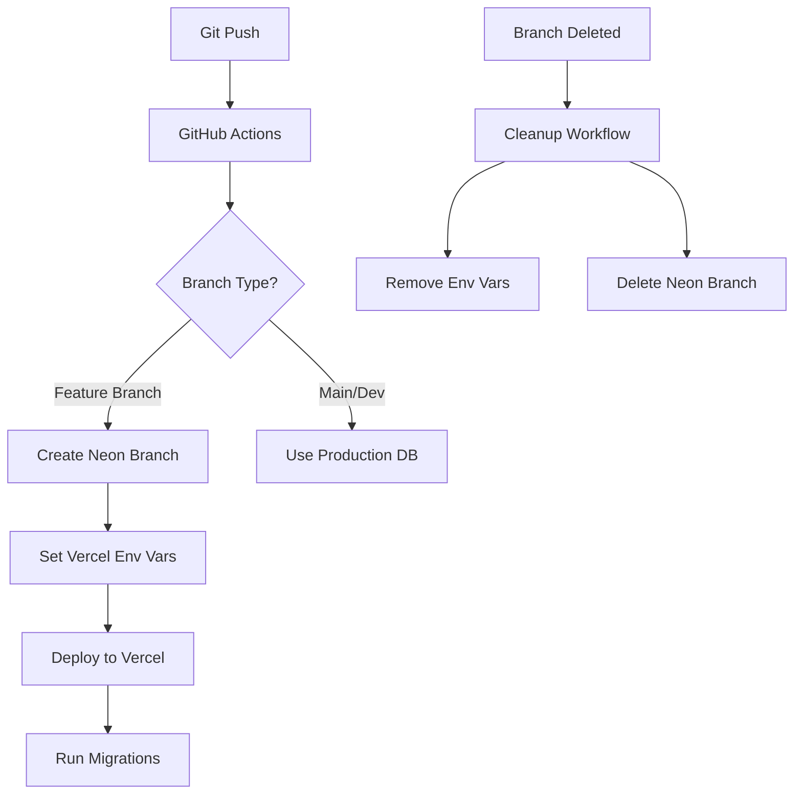

# Vercel + Neon Branch Deployment Guide

## Table of Contents
1. [Overview](#overview)
2. [Architecture](#architecture)
3. [Setup Requirements](#setup-requirements)
4. [How It Works](#how-it-works)
5. [Configuration](#configuration)
6. [Workflows](#workflows)
7. [Troubleshooting](#troubleshooting)
8. [Monitoring](#monitoring)
9. [Security](#security)
10. [Best Practices](#best-practices)

## Overview

This system automatically provisions isolated database environments for each Git branch, ensuring that preview deployments on Vercel have their own dedicated Neon database branch. This prevents data conflicts between different feature branches and provides a production-like environment for testing.

### Key Features
- 🔄 Automatic database branch creation for each Git branch
- 🔐 Branch-specific environment variables in Vercel
- 🚀 Seamless integration with Vercel preview deployments
- 🧹 Automatic cleanup when branches are deleted
- 🔁 Retry logic for handling race conditions
- 📊 Database migration support

## Architecture



### Components

1. **GitHub Actions Workflows**:
   - `nextjs-deploy-with-neon.yml`: Main deployment workflow
   - `cleanup-branch-resources.yml`: Resource cleanup workflow

2. **Vercel Environment Variables**:
   - `DATABASE_URL`: Branch-specific database connection (pooled)
   - `DATABASE_URL_UNPOOLED`: Direct database connection
   - `DEPLOYMENT_BRANCH`: Current branch name

3. **Neon Database Branches**:
   - Named using pattern: `branch/{sanitized-branch-name}`
   - Isolated data environment for each feature branch
   - Automatic creation and deletion

## Setup Requirements

### Prerequisites

1. **GitHub Secrets**:
   ```
   VERCEL_TOKEN         # Vercel API token
   VERCEL_ORG_ID        # Vercel organization ID
   VERCEL_PROJECT_ID    # Vercel project ID
   NEON_API_KEY         # Neon API key
   NEON_PROJECT_ID      # Neon project ID
   ```

2. **Vercel CLI**: Version 28.9.0 or later (for `--git-branch` support)

3. **Project Structure**:
   - Next.js application in `src/frontend/nextjs-app/`
   - Drizzle ORM for database management
   - Database migrations in `drizzle/` directory

### Initial Setup

1. **Create Vercel Project**:
   ```bash
   vercel link
   ```

2. **Get Vercel Project Info**:
   ```bash
   vercel project ls
   ```

3. **Create Neon Project**:
   - Go to [Neon Console](https://console.neon.tech/)
   - Create a new project
   - Copy the project ID

4. **Configure GitHub Secrets**:
   - Go to Settings → Secrets → Actions
   - Add all required secrets

## How It Works

### Deployment Flow

1. **Branch Push**: Developer pushes to a feature branch
2. **Workflow Triggers**: GitHub Actions workflow starts
3. **Branch Sanitization**: Branch name is sanitized for database naming
   ```bash
   # Example: feature/user-auth → feature-user-auth
   sed 's/[^a-zA-Z0-9.-]/-/g' | tr '[:upper:]' '[:lower:]' | cut -c1-63
   ```
4. **Neon Branch Creation**: Creates database branch if it doesn't exist
5. **Environment Variables**: Sets branch-specific DATABASE_URL in Vercel
6. **Deployment**: Vercel builds and deploys the application
7. **Migrations**: Database migrations run against the new branch

### Environment Variable Management

**Note**: If the Vercel project is not connected to a Git repository, environment variables are passed during deployment:
```bash
vercel deploy --prebuilt \
  -e DATABASE_URL="$DATABASE_URL" \
  -e DATABASE_URL_UNPOOLED="$DATABASE_URL_UNPOOLED" \
  -e DEPLOYMENT_BRANCH="$BRANCH_NAME"
```

For Git-connected projects, branch-specific variables can be set using:
```bash
vercel env add DATABASE_URL preview --git-branch="branch-name" <<< "$DATABASE_URL"
```

These variables:
- Are deployment-specific when passed with `-e` flag
- Available at runtime for the deployment
- Do not persist across redeployments (must be passed each time)

## Configuration

### Branch Connection Module

The `branch-connection.ts` module handles database URL resolution:

```typescript
// Determines environment based on Vercel env vars
export function getEnvironment(): 'production' | 'preview' | 'development' {
  if (process.env.NODE_ENV === 'development' && !process.env.VERCEL) {
    return 'development';
  }
  if (process.env.VERCEL_ENV === 'production') {
    return 'production';
  }
  if (process.env.VERCEL_ENV === 'preview') {
    return 'preview';
  }
  // ... additional logic
}
```

### Migration Script

The `migrate-only.ts` script runs migrations in CI/CD:

```typescript
import { migrate } from 'drizzle-orm/postgres-js/migrator';
import { db } from '../app/db/drizzle';

await migrate(db, {
  migrationsFolder: 'drizzle',
});
```

## Workflows

### Deployment Workflow Features

- **Concurrency Control**: Prevents multiple simultaneous deployments per branch
- **Code Quality Checks**: Runs linting and type checking before deployment
- **Build Optimization**: Uses Vercel's prebuilt artifacts
- **Custom Aliases**: Creates branch-specific URLs like `feature-auth-{owner}.vercel.app`

### Cleanup Workflow Features

- **Automatic Triggers**: On branch deletion or PR merge
- **Protected Branches**: Skips cleanup for main and dev branches
- **Error Handling**: Continues cleanup even if some steps fail
- **Comprehensive Logging**: Details what was cleaned up

## Troubleshooting

### Common Issues

1. **"No database URL found for preview environment"**
   - **Cause**: Environment variable not set or race condition
   - **Fix**: Check Vercel dashboard for branch-specific variables
   - **Prevention**: Retry logic handles most cases automatically

2. **Migration Failures**
   - **Cause**: Database not ready or connection issues
   - **Fix**: Re-run deployment or manually run migrations
   - **Check**: Verify DATABASE_URL is correct in Vercel

3. **Cleanup Failures**
   - **Cause**: Resources already deleted or API issues
   - **Fix**: Check logs, manual cleanup if needed
   - **Monitor**: GitHub Actions tab shows cleanup status

### Debug Commands

```bash
# List Vercel environment variables
vercel env ls preview

# Check specific branch variables
vercel env ls preview | grep "branch-name"

# Test database connection
curl https://your-app.vercel.app/api/debug/db-connection

# List Neon branches
curl -H "Authorization: Bearer $NEON_API_KEY" \
  "https://console.neon.tech/api/v2/projects/$PROJECT_ID/branches"
```

### Manual Cleanup

If automatic cleanup fails:

```bash
# Remove Vercel env vars (only needed for Git-connected projects)
# vercel env rm DATABASE_URL preview --git-branch="branch-name" --yes
# Note: For non-Git-connected projects, env vars are deployment-specific and auto-removed

# Delete Neon branch via API
curl -X DELETE -H "Authorization: Bearer $NEON_API_KEY" \
  "https://console.neon.tech/api/v2/projects/$PROJECT_ID/branches/$BRANCH_ID"
```

## Monitoring

### Health Checks

Create a health endpoint:
```typescript
// app/api/health/db/route.ts
export async function GET() {
  try {
    await db.execute(sql`SELECT 1`);
    return Response.json({
      status: 'healthy',
      branch: process.env.VERCEL_GIT_COMMIT_REF
    });
  } catch (error) {
    return Response.json({
      status: 'unhealthy',
      error: error.message
    }, { status: 500 });
  }
}
```

### Monitoring Checklist

- [ ] GitHub Actions workflow status
- [ ] Vercel deployment logs
- [ ] Neon branch creation/deletion events
- [ ] Database connection health checks
- [ ] Environment variable consistency

### Alerts

Set up notifications for:
- Failed deployments
- Failed cleanups
- Database connection errors
- Migration failures

## Security

### Best Practices

1. **Secret Management**:
   - Use GitHub secrets for all sensitive values
   - Never commit credentials to code
   - Rotate API keys regularly

2. **Access Control**:
   - Limit GitHub Actions permissions
   - Use branch protection rules
   - Restrict Neon API key permissions

3. **Environment Isolation**:
   - Each branch has isolated database
   - No cross-branch data access
   - Automatic cleanup prevents data leaks

4. **Audit Trail**:
   - GitHub Actions logs all operations
   - Vercel logs environment changes
   - Neon tracks branch operations

## Best Practices

### Development Workflow

1. **Feature Branches**:
   - Use descriptive branch names
   - Keep branches short-lived
   - Delete after merging

2. **Database Changes**:
   - Always use migrations
   - Test migrations locally first
   - Review schema changes in PRs

3. **Environment Variables**:
   - Document all required variables
   - Use consistent naming
   - Keep production values separate

### Performance Tips

1. **Optimize Workflows**:
   - Use caching for dependencies
   - Parallelize independent steps
   - Skip unnecessary builds

2. **Database Efficiency**:
   - Clean up old branches regularly
   - Monitor database usage
   - Use connection pooling

3. **Cost Management**:
   - Set up branch limits in Neon
   - Monitor Vercel usage
   - Automate cleanup aggressively

### Team Guidelines

1. **Documentation**:
   - Update this guide when making changes
   - Document new environment variables
   - Add troubleshooting tips

2. **Communication**:
   - Notify team of workflow changes
   - Share debugging discoveries
   - Report recurring issues

3. **Maintenance**:
   - Regular audits of orphaned resources
   - Update dependencies
   - Review and optimize workflows

## Appendix

### Environment Variable Reference

| Variable | Scope | Description |
|----------|--------|-------------|
| DATABASE_URL | Branch-specific | Pooled database connection |
| DATABASE_URL_UNPOOLED | Branch-specific | Direct database connection |
| DEPLOYMENT_BRANCH | Branch-specific | Current Git branch name |
| VERCEL_ENV | System | Vercel environment type |
| VERCEL_GIT_COMMIT_REF | System | Git branch/tag name |

### Useful Links

- [Vercel CLI Documentation](https://vercel.com/docs/cli)
- [Neon API Documentation](https://neon.tech/docs/api)
- [Drizzle ORM Documentation](https://orm.drizzle.team/)
- [GitHub Actions Documentation](https://docs.github.com/actions)
